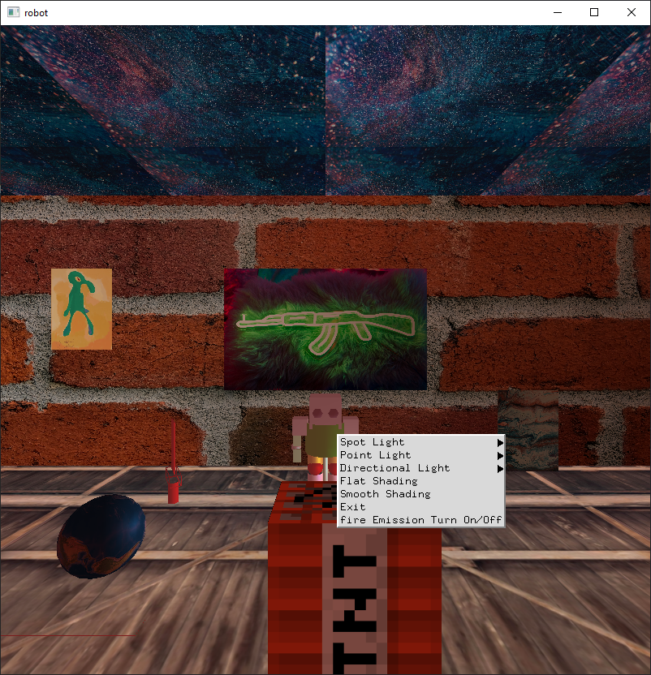

# PREREQUISITES
- vcpkg
- cmake
- set environment variable VCPKG_FEATURE_FLAGS=manifests  

## LightWithTexture  
  

## 使用方法  
+ 右鍵選單 - 調整點光源、手電筒、平行光、shading method、texture emission等功能
+ 數字鍵0 - 同時查看4個view
+ 數字鍵1 - 從+x軸方向往起始點看
+ 數字鍵2 - 從+y軸方向往起始點看
+ 數字鍵3 - 從+z軸方向往起始點看
+ 數字鍵4 - 以相機的視角看出 (default)
+ 英文鍵盤n - 將相機往正前方移動
+ 英文鍵盤f - 將相機往正後方移動 
+ 英文鍵盤w - 機器人向正前方移動(開啟後持續移動)
+ 英文鍵盤s - 停下機器人
+ 左右鍵 - 更改機器人方向  

## 已知問題  
+ spot light結果不如預期，在數字鍵0的模式下從相機的視角看出去結果是正確的，但是其他視角不會亮，關閉所有光源僅開啟spot light後就能重現此bug。

## 成果圖  
+ right click menu
  + 
+ texture emission
  + 
+ directional light
  + 
+ point light
  + 